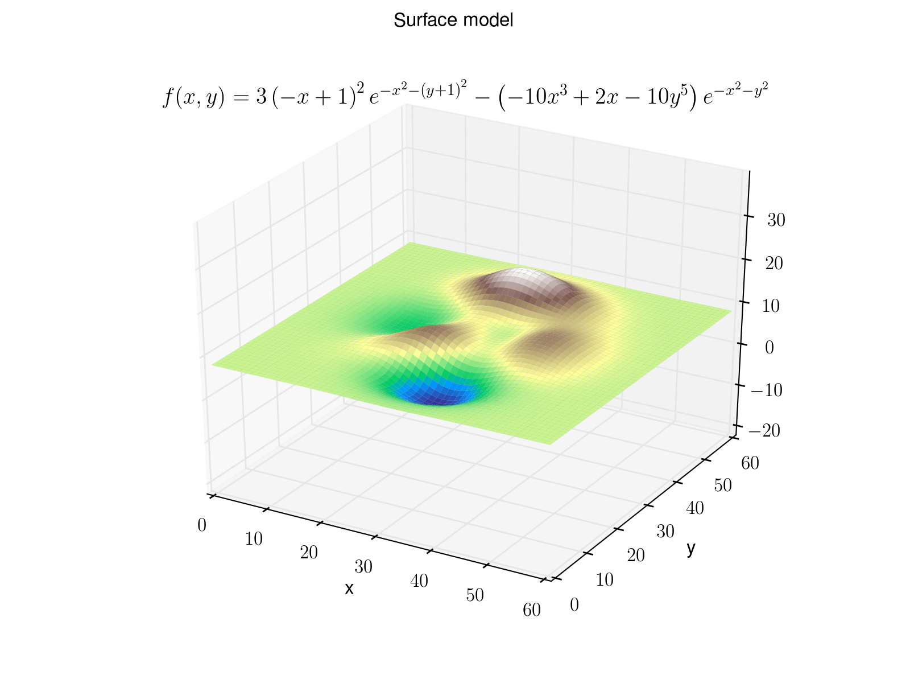
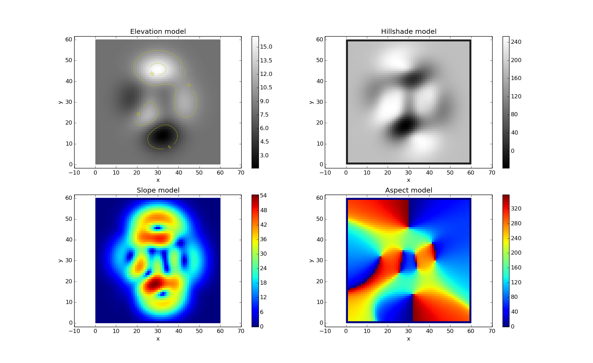

# Terrain-Analysis
Collection of scripts related to terrain analysis

## Contents
Contains two scripts. One finished and one unfinished.

The [Jupyter Notebook](http://jupyter.org/) called [Equations.ipynb](Equations.ipynb) contains equations collected from various places.

## Function
The script takes a surface model.

The surface is converted into raster and simple terrain analysis is performed

## Dependencies
[Python](https://www.python.org/)

[NumPy](http://www.numpy.org/)

[matplotlib](http://matplotlib.org/)
